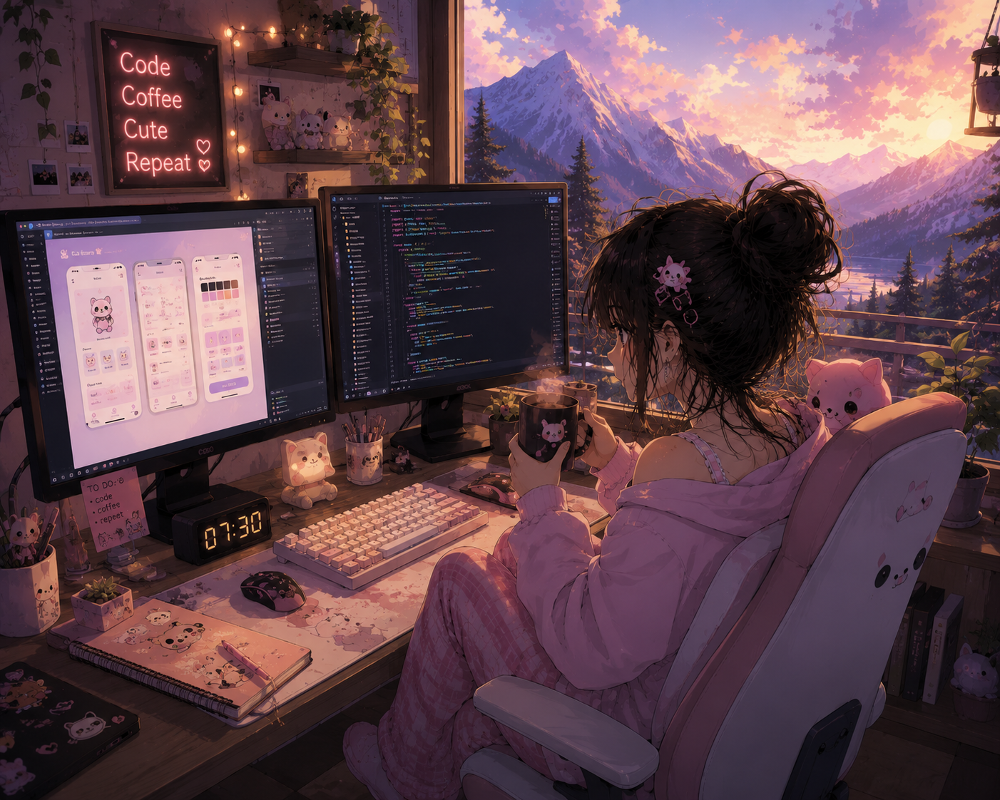

<div align="center">

# 🌸 Hey, I'm Anchal Sharma 🌸


<br>



<br><br>


</div>

---

# 🎀 About Me

```bash
╭───────────── 🎀 SYSTEM INFO 🎀 ─────────────╮

$ whoami
👩‍💻 Frontend & Mobile Developer

$ skills --list
⚛️ React Native
⚛️ React.js
✨ JavaScript
🎨 UI/UX Design
🐍 Python
☕ Java
🧪 Jest

$ current_status
🌸 Building beautiful user experiences
☕ Drinking coffee
🚀 Shipping cool projects

$ interests
💖 Mobile Apps
🎨 Creative Design
🌐 Frontend Development
✨ Clean & Elegant Interfaces

$ motto
"Code cute. Build smart. Stay curious."

╰────────────────────────────────────────────╯
```

---

# 💖 Tech Arsenal

<div align="center">

### 🌸 Frontend & Mobile


<br>

### 🎀 Design


<br>

### 💗 Backend & Programming


<br>

### 🌷 Testing


</div>

---

# 🌷 Core Skills

<table align="center">
<tr>
<td align="center" width="33%">

### 📱 Mobile

💖 React Native

</td>

<td align="center" width="33%">

### ⚛️ Frontend

💗 React.js

💗 JavaScript

</td>

<td align="center" width="33%">

### 🎨 Design

💗 UI/UX Design

</td>
</tr>

<tr>
<td align="center">

### 🐍 Python

🌸 Automation

🌸 APIs

</td>

<td align="center">

### ☕ Java

🌸 OOP

🌸 Backend

</td>

<td align="center">

### 🧪 Testing

🌸 Jest

🌸 Unit Testing

</td>
</tr>
</table>

---

<div align="center">


<div align="center">

### 🌸 Design • Develop • Deploy • Repeat 🌸

☕ Powered by coffee, creativity & curiosity 💖


</div>
